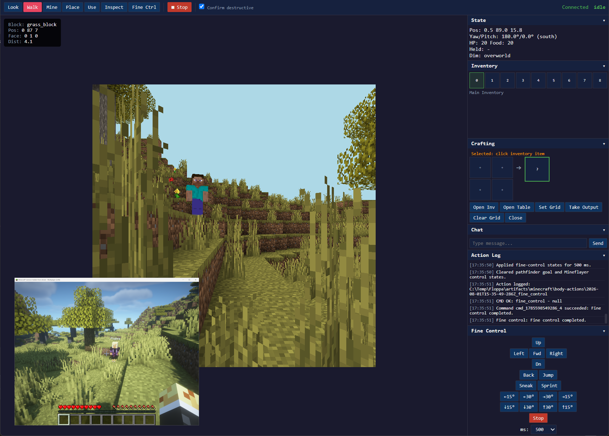
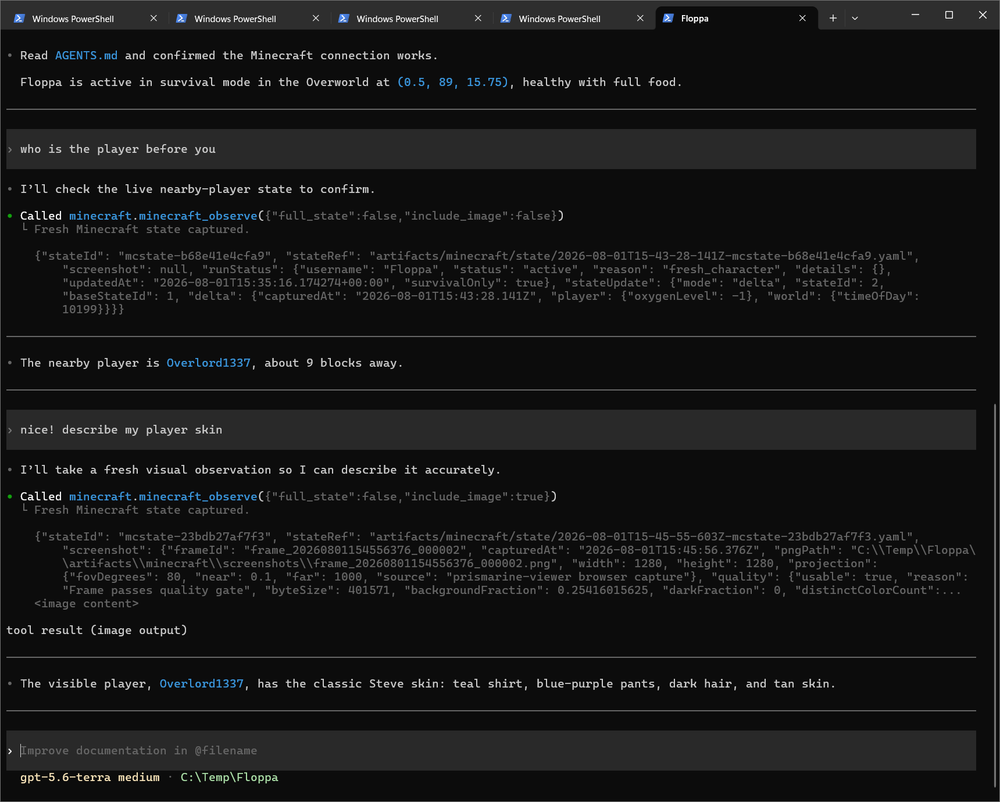

# pm-minecraft

A self-contained Minecraft survival body for MCP clients. 

It runs Mineflayer, Prismarine Viewer, a local web UI, and a Streamable HTTP MCP server. 

It does not contain an agent, model, or cognitive runtime. Only some minimal instruction
telling your agent of choice how to use the MCP, look at screenshots and make
custom TypeScript scripts, that can be executed via MCP.

Huge thanks to https://github.com/minedojo/voyager and https://github.com/Mega-Gorilla/Discovery :3

This is part of an ongoing effort on my side to make a fun cognitive architecture AI companion that can play minecraft with you. Also works as standalone ^_^

## Setup

Requirements: Windows PowerShell, Node.js 20+, Python 3.12 through `py`, and a
reachable Minecraft Java 1.19.x server with the character in survival mode.

```powershell
Set-Location C:\workspace\pm-minecraft-mcp
.\setup.ps1
```

The setup follows the shared PM workflow: it uses `uv` to create this
repository's Python 3.12 `.venv`, syncs its lockfile, and installs locked Node
packages. `scripts/setup.ps1` remains as a compatibility wrapper.

If it doesn't work tell your coding agent to fix it.

## Minecraft

I stole the setup from https://github.com/Mega-Gorilla/Discovery.

I have never modded Minecraft manually, what works for me: 

- Download Prism
- Install 1.19.4
- Install Fabric Loader 0.19.3 
- Install these mods via Prism:
    - Fabric API
    - CompleteConfig
    - Mod Menu
    - Multiplayer Server Pause (Forge)
    - item-pickup-range by wenhao (/setPickupRange 5)
- Make Survival World, Cheats Enabled, Peaceful
- Enter and "Open to LAN" on Port 12345

## Create and start a character

```powershell
.\scripts\init_character.ps1 `
  -Name Floppa `
  -AgentRoot C:/Temp/Floppa `
  -ArtifactRoot C:/Temp/Floppa/artifacts/minecraft

.\scripts\start_minecraft_mcp.ps1 `
  -Name Floppa `
  -MinecraftHost 127.0.0.1 `
  -MinecraftPort 12345 `
  -AgentRoot C:/Temp/Floppa `
  -ArtifactRoot C:/Temp/Floppa/artifacts/minecraft
```

The initializer creates the agent workspace, `memory/minecraft/`, `drafts/`,
`skills/`, `lib/minecraft.ts`, and `.mcp.json`. The launcher prints the local
web UI, Prismarine viewer, and MCP URLs. For multiple characters, use unique
`-WebPort`, `-ViewerPort`, and `-McpPort` values.

Every `deploy/drafts/*.ts` example is copied into the workspace's `drafts/` and
listed in its `AGENTS.md`. They run as-is through
`minecraft_execute_typescript`, so the agent can execute one directly or copy
its guard-and-verify shape into a new draft. Add an example to `deploy/drafts/`
to ship it with every new character.

The agent can call `minecraft_list_capabilities` before it writes a new behavior.
If no capability fits, the agent writes a TypeScript draft from generic body actions.
The agent runs the draft with a deterministic postcondition.
After a successful run, `minecraft_promote_skill` copies the draft into `skills/`.
The promotion record includes the source hash, execution ID, and postcondition.

Entity observations include stable runtime IDs while each entity remains loaded.
The generic `attack_entity` action performs one ordinary survival attack against an observed ID.
For a kill goal, the agent must verify a survival result, such as an inventory increase.
A skill can combine observation, movement, equipment, attacks, and verification into behaviors such as hunting.

Stop an instance with:

```powershell
.\scripts\stop_minecraft_mcp.ps1 -ArtifactRoot C:/Temp/Floppa/artifacts/minecraft
```

Then use it from the workspace:

```powershell
Set-Location C:/Temp/Floppa
codex
```

Codex reads `.mcp.json`. Prompt it to use the `minecraft` server; state logs
and screenshots are under `./artifacts/minecraft`.

## Perception and viewer modes

`minecraft_find_block` defaults to `require_visible: true`. This is the normal
survival setting: it returns only blocks with an unobstructed ray from the
character's head. An agent must explore, move to a better viewpoint, or use a
different observation when it cannot see the target. For long-range planning,
set `require_visible: false`; the result is a loaded-world location only and
must still be reached and visibly verified before mining.

## On-disk logging

Everything is written under the character's artifact root
(`artifacts/minecraft/`):

- `states/` — one raw full state file per snapshot
  (`<timestamp>-mcstate-<id>.yaml`). Each state stores only the chat messages
  first seen in that state, so **every chat message exists exactly once** in
  the whole tree; reconstruct the transcript by walking the files in order.
  Each state links to its screenshot; it never contains image bytes or
  duplicated screenshot metadata. `current_state.yaml` is a pointer file that
  only contains the relative path of the most recent state.
- `screenshots/` — the only place pictures live (`.png` plus a small metadata
  sidecar per frame). States and actions only *link* to these.
- `actions/` — one flat yaml per MCP tool call, named
  `<timestamp>_<tool>.yaml`, written on the fly (a starter file with the tool
  and input appears the moment the call starts, before/after state + screenshot
  links are appended as snapshots happen, and the raw pretty-printed tool
  output, duration and any exception land in the final rewrite). Fields:
  `tool`, `tool_input`, `tool_output` (both pretty JSON block scalars), the
  four links `before_state_path` / `before_screenshot_path` /
  `after_state_path` / `after_screenshot_path` (empty when the tool made no
  state, before-only for tools like `minecraft_observe` that make one), plus
  lookup headers such as `execution_id` / `skill_path` for skills. Success or
  failure is read straight from the return data in `tool_output`; exceptions
  land in an `error:` block.
- `mcp-server.log` — every caught body/network error and every unhandled
  exception (with traceback) lands here.

Tool results return the same links (`beforeStatePath` / `afterStatePath` /
`beforeScreenshotPath` / `afterScreenshotPath`) instead of inlining the whole
state, so the model follows the files when it needs details.

Screenshots are captured and written to `artifacts/minecraft/screenshots` for
**every** state - before and after every action, on every `minecraft_observe`
call - regardless of `include_image`, as
long as the server is started with image capture enabled (default; disable
with `--no-images`). This gives a complete, seamless on-disk visual history of
the run for later analysis, even for states the agent itself never looked at.

`include_image` only controls whether the pixel bytes are also attached to
that specific tool call's response so the agent can see them right now;
`minecraft_observe` defaults `include_image=true` (every other tool defaults
`include_image=false` to keep routine actions cheap in context). Pass
`include_image=false` to `minecraft_observe` to skip putting the image in the
response when only state is needed - the screenshot is still captured and
saved to disk either way. A screenshot that was requested but failed to
capture (viewer/bot not ready, no supported browser found) is reported as
`screenshot: {"error": ..., "message": ...}`, distinct from `screenshot: null`
(image capture is disabled server-wide via `--no-images`).

## Navigation (walk only)

`minecraft_walk_to` only walks. It can climb 1-block steps and step down 1
block, but it does **not** dig, place scaffolding, tower, parkour, or open
doors. It aims at the horizontal position (`GoalNearXZ`, so terrain height is
chosen automatically) using a **static goal** inside a start-centered region of
`chunk_limit` chunks (default 3, capped by the server's configured max). If the
target is outside that region, has no standable floor nearby, or has no on-foot
path, the call fails fast instead of sitting around.

`tolerance` defaults to **1.5**. The search A* budget (`walkSearchTimeoutMs`,
default 1000) bounds how long pathfinding can take before it fails with a
"move closer" message.

## Tunneling & long-distance navigation

- `minecraft_mine_block` normally requires head-line-of-sight, which is
  impossible for the adjacent feet-level block inside a 1-wide shaft. It now
  skips that gate for targets within `--mine-visibility-ignore-distance`
  blocks (default `3`, pass `-MineVisibilityIgnoreDistance` to the start
  script) so you can tunnel straight ahead from a 1-wide tunnel.
- `minecraft_walk_to` accepts a `chunk_limit` up to `--max-chunk-limit`
  (default `8`). Larger requests are rejected with
  `error: requested chunk limit (N) greater than allowed (M)`.
- `minecraft_pillar_up` reports a clear `pillar_up_needs_placeable_block`
  error when the held item is not a placeable block, and explains that the
  landing headroom must be cleared first; `dig_up` clears headroom per-hop.
- Ship-with-every-character drafts (auto-deployed to `drafts/`):
  - `dig_staircase(height, distance, stop)` — walkable 2-tall descending ramp.
  - `clear_room(width, depth, height)` — expands a 1-wide tunnel into a room.
  - `dig_up(targetY)` / `descend_to_depth(targetY, stopOnOre)` — hazard-safe
    single-hop ascent / descent that inspects for lava/water before digging.
  - `tunnel_forward` / `tunnel_iron` / `branch_mine_safe_iron` — tunneling & ore
    mining, all hazard-guarded (they stop before digging into water/lava).
  - `place_crafting_table` / `place_block` / `climb_pillar` / `find_village`
    (long-distance patrol that reports when it sees a villager).

## Halted runs, timeouts & the anti-stall guard

- `minecraft_stop` halts the active Mineflayer command **and** terminates any
  running TypeScript skill process (kills both). `minecraft_kill_command`
  stops only the current physical command; `minecraft_kill_skill` terminates
  only the running skill process.
- **Cooperative cancellation**: skills check a kill-signal marker in every API
  call / sleep and break out cleanly (`SkillCancelledError`) when stopped, so
  `minecraft_stop`/`kill_skill` (and a client disconnect) halt a skill quickly
  and let it write its result — the runner is only hard-killed if it ignores
  the marker.
- **Configurable skill timeout**: `minecraft_set_skill_timeout(seconds)`
  (1..3600) sets the max duration for `minecraft_execute_typescript` and
  `minecraft_collect_blocks` (default 90; launch-time default via
  `-SkillTimeoutSeconds` / `--skill-timeout-seconds`). Long skills run in a
  separate subprocess and are terminated server-side at that timeout.
- **Match your client window**: the agent's `.mcp.json` `requestTimeoutMs`
  (character default `200000`) must stay ABOVE the server skill timeout,
  otherwise long skills are cut off client-side before they finish. Rule of
  thumb: set `minecraft_set_skill_timeout` to `requestTimeoutMs - 10s`.
- The repeated-no-gain circuit breaker is **disabled by default**. It was a
  relic of older, weaker models that retried an identical no-gain operation in
  a loop; keyed to a single "relevant item", it wrongly blocked unrelated
  skill ops. Re-enable it explicitly when you want it with the
  `--enable-anti-stall-guard` MCP argument (`-EnableAntiStallGuard` on the
  start script).

## State transparency

- Every state (full and delta) always carries the player `position`,
  `health`, `food`, and `foodSaturation`, and every result always reports the
  current `heldItem`, so an agent never has to infer its own vitals or held
  tool from a diff.
- `minecraft_collect_blocks` equips the cheapest tool that harvests the target
  block up front (instead of dying mid-run with an `unharvestable` rejection),
  and the body no longer swaps the held item except when `collect_blocks`
  needs a different tool.

## Tips from live testing (agent ergonomics)

These come from real in-game sessions with a coding agent and are worth
encoding into your agent's AGENTS.md or skill prompts:

- **Coordinates are flat** on the wrapper tools: `minecraft_walk_to(x,y,z,…)` /
  `minecraft_mine_block(x,y,z,…)` take separate numbers, NOT a `position`/`block`
  object. For nested action schemas use `minecraft_call` with the shapes in
  `minecraft_info` (e.g. `{"action":"place_block","parameters":{"referenceBlock":{…}}}`).
- **Probe before you dig**: read `hazards` (water/lava) and `inspect` the next
  cell before tunneling. Shipping drafts stop on a hazard; a raw `mine_block`
  into water/lava strands the bot.
- **Held-tool drift**: a climb-y `mine_block` or `pillar_up` can leave a
  placeable block (dirt/cobblestone) in hand instead of a tool. Re-equip and
  verify after any climb-y mine; tools also break on durability, so keep a
  spare pickaxe.
- **Mine wide, not 1-wide**: 1-wide tunnels only expose the front face and
  tunnel past side-wall ore. Use `clear_room`/`branch_mine_safe_iron` (3-wide)
  to expose ore, and treat `find_block`'s line-of-sight (anti-x-ray) result as
  "go look / mine to reveal it".
- **Long overland travel works** with the dynamic chunk-streaming walk; keep
  each `walk_to` under your client window and it covers far more ground than
  one-chunk hops.
- **Timeouts**: keep `minecraft_set_skill_timeout` at `requestTimeoutMs - 10s`
  so long skills finish instead of being cut off. `minecraft_info` reports the
  current value; re-read it whenever docs drift.
- **Prefer many small reversible skills** over one huge irreversible one; each
  needs a deterministic postcondition. `minecraft_observe` + `minecraft_stop`
  let you track and halt any stray run.

## Cool stuff

Here is the WebUI where you can manually control the character or look at how the coding agent uses the MCP.

[](https://top.lel)

And here is Codex describing my character's skin. Prismarine only renders default Steve :(

[](https://top.lel)


## Development

```powershell
npm test
npm run build
.\.venv\Scripts\python.exe -m compileall mcp
```

## Using it programmatically (pip install)

`pm-minecraft` can be embedded directly into another Python project — for
example a cognitive architecture that keeps a Minecraft character alive in
daemon threads. No ps1 scripts, no `subprocess.Popen` of launchers, and no
detached child processes anywhere: every Node process is attached to its
Python parent through a **stdin lifecycle pipe**. When the parent dies —
gracefully or hard-killed — the OS closes the pipe, Node sees EOF, and shuts
down cleanly. Same semantics on Windows and Linux.

### Install

```powershell
pip install git+https://github.com/flamingrickpat/pm-minecraft.git
```

Requirements for the target machine:

- Python 3.12, and Node.js 20+ on PATH (`node` and `npm`).
- The first time a character starts in a Python environment, the package
  installs its Node dependency tree once into
  `<venv>/pm-minecraft-runtime/<version>/` (runs `npm ci` under a file lock;
  one-time, a couple of minutes). Every later start is instant. Pre-warm with
  `pm_minecraft_mcp.ensure_node_runtime()`.
- A reachable Minecraft Java 1.19.x server with the character in survival
  mode (same as the standalone setup).

### Entry points

Everything is one typed config object plus blocking functions designed to run
in daemon threads:

- `pm_minecraft_mcp.ServerConfig(...)` — all settings: Minecraft host/port,
  username, agent home, artifact root, web/viewer/MCP hosts+ports, startup
  timeout, image capture, skill limits, view distance.
- `pm_minecraft_mcp.execute_node_main_loop(config)` — runs the Minecraft body
  (one Node process) and blocks until it exits.
- `pm_minecraft_mcp.execute_python_main_loop(config, manage_body=True)` —
  runs the MCP server and blocks while it serves. With the default
  `manage_body=True` it also starts and owns the body itself (one thread is
  enough); with `manage_body=False` it expects the body to be managed by a
  companion `execute_node_main_loop` thread and waits for it to become ready.
- `pm_minecraft_mcp.init_character(name, agent_root, artifact_root, ...)` —
  Python port of `scripts/init_character.ps1`: creates the agent workspace
  (`AGENTS.md`, `.mcp.json`, `lib/minecraft.ts`, `drafts/`, `skills/`,
  `memory/minecraft/`). Refuses non-empty agent roots.
- `pm_minecraft_mcp.check_prerequisites(config)` — the fail-fast checks,
  also run automatically before anything spawns: agent home initialized,
  Minecraft server reachable over TCP, local service ports free, `node` on
  PATH. Each failure raises immediately with a specific message. After the
  body joins, the negotiated version must be 1.19.x and the game mode
  survival, otherwise the entry point raises.

### Example

`examples/main.py` starts a character in two daemon threads and shuts down on
Ctrl-D:

```python
import threading
from pathlib import Path

from pm_minecraft_mcp import (
    ServerConfig,
    execute_node_main_loop,
    execute_python_main_loop,
    init_character,
)

AGENT_ROOT = Path.home() / "characters" / "Floppa"

if not (AGENT_ROOT / "AGENTS.md").exists():
    init_character(
        name="Floppa",
        agent_root=AGENT_ROOT,
        artifact_root=AGENT_ROOT / "artifacts" / "minecraft",
        minecraft_host="127.0.0.1",
        minecraft_port=12345,
        web_port=3000,
        viewer_port=3007,
        mcp_port=8765,
    )

config = ServerConfig(
    minecraft_host="127.0.0.1",
    minecraft_port=12345,
    username="Floppa",
    agent_home=AGENT_ROOT,
    artifact_root=AGENT_ROOT / "artifacts" / "minecraft",
    web_host="127.0.0.1",
    web_port=3000,
    viewer_port=3007,
    mcp_host="127.0.0.1",
    mcp_port=8765,
    startup_timeout_seconds=90,
    capture_images=True,
    max_skill_characters=50000,
    viewer_scale=1,
    viewer_fov=80,
    view_distance=24,
)

threading.Thread(target=execute_node_main_loop, args=(config,), daemon=True).start()
threading.Thread(
    target=execute_python_main_loop, args=(config,), kwargs={"manage_body": False}, daemon=True
).start()

try:
    while True:
        input()  # Ctrl-D (EOF) ends the process; children follow via stdin EOF
except (EOFError, KeyboardInterrupt):
    pass
```

The single-thread variant works too: one daemon thread on
`execute_python_main_loop(config)` starts both body and MCP.

### Multiple characters

Use one config (unique username + unique web/viewer/MCP ports) per character
and give each one its own pair of daemon threads. The Node runtime is shared
read-only between all characters in the same Python environment.

### Agent-side behavior is unchanged

From the MCP client's perspective nothing changes: the same tool names,
schemas, `.mcp.json` layout, and `minecraft_execute_typescript` contract. An
agent can still write an arbitrary TypeScript draft into its workspace and
execute it against the server; drafts run through the package's tsx runtime
with `lib/minecraft.ts` from the character home.

### Lifecycle guarantees

- The body is one Node process (no npm/tsx wrapper processes); skill runs
  are also one process each. There are no process trees to chase.
- Children never get `CREATE_NEW_PROCESS_GROUP` and are never `taskkill`ed.
  Shutdown is stdin-EOF first, plain `kill()` as a last resort.
- Killing the embedding process at any moment (including `taskkill /F` or
  `kill -9`) cannot orphan the body: the lifecycle pipe breaks and Node exits
  within seconds.
